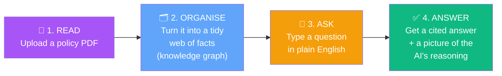
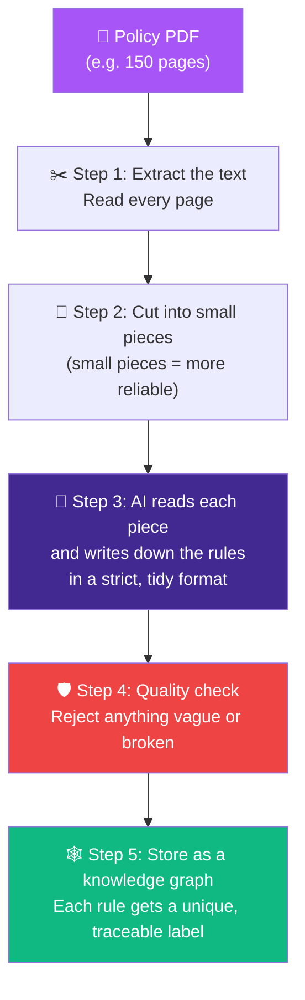
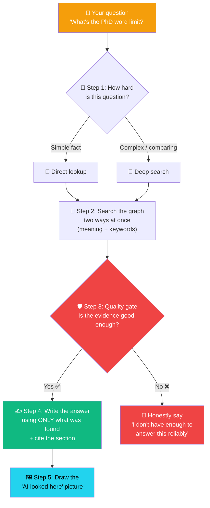
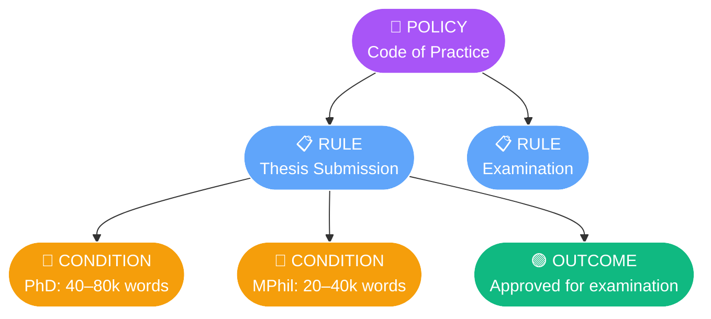

<div align="center">

# 🎓 Transparent Policy GraphRAG

### An AI assistant for university policy that **shows its work**

*Ask a question in plain English → get an answer that cites the exact rule → and see a picture of how the AI reached it.*

<br>


**Author:** Alireza (Allen) Sharafzad · MSc Data Science & AI, Bournemouth University
**Document studied:** BU *8A Code of Practice for Research Degrees 2024–25*

</div>

---

## 📖 Table of Contents

| For everyone | For the curious | For developers |
|---|---|---|
| [What is this?](#-what-is-this-in-one-minute) | [The problem we solve](#-the-problem-a-true-story) | [Installation](#-installation-step-by-step) |
| [How it works (4 steps)](#-how-it-works-in-4-simple-steps) | [Journey A: Teaching it a policy](#-journey-a--teaching-the-assistant-a-new-policy) | [Running the app](#-running-the-app) |
| [Why you can trust it](#-why-you-can-trust-the-answers) | [Journey B: Asking a question](#-journey-b--asking-a-question) | [Tech stack](#-the-technology-stack) |
| [Jargon buster](#-jargon-buster-no-experience-needed) | [The "knowledge graph" explained](#-what-is-a-knowledge-graph) | [Project layout](#-project-layout) |

---

## 🌟 What is this, in one minute?

Imagine you are a PhD student. You have a **150-page university rulebook**, and you just want to know one thing:

> *"What's the maximum word count for my thesis?"*

You could spend 30 minutes searching the PDF. Or you could ask this app and get:

> ✅ **A direct answer** — *"A doctoral thesis is normally 40,000–80,000 words."*
> 📌 **The exact source** — *"(BU Code of Practice §13.1)"*
> 🖼️ **A picture** showing precisely which rules the AI read to answer you.

That's the whole idea. **It's a smart, trustworthy assistant for dense official documents** — and unlike a normal chatbot, it never makes things up, and it always shows you where its answer came from.

<div align="center">

```
┌──────────────────┐     ┌──────────────────┐     ┌──────────────────┐
│   📄  You upload  │ ──► │   🧠  The app    │ ──► │  💬  You ask &   │
│   a policy PDF   │     │  understands it  │     │   get a trusted  │
│                  │     │  & remembers it  │     │   cited answer   │
└──────────────────┘     └──────────────────┘     └──────────────────┘
```

</div>

---

## 🔍 The problem: a true story

Most AI document assistants work by **chopping the document into chunks** and finding the chunk that "looks most similar" to your question. This works for blog posts. **It fails dangerously for rulebooks.** Here's why:

> A **PhD** thesis limit (≈80,000 words) and an **MPhil** thesis limit (≈40,000 words) are written almost identically. To a normal AI, they look like the *same thing*. So when you ask about *your* thesis, it might blend them together and tell you **"between 40,000 and 80,000 words"** — which is **wrong for everybody**.

For a student, a wrong word limit could mean a failed submission or a wasted year. **"Looks similar" is not the same as "is correct."**

### Our fix: teach the AI the *structure*, not just the words

Instead of a pile of text chunks, we turn the policy into a **knowledge graph** — a web of clearly-labelled, connected facts. The PhD rule and the MPhil rule become **separate, clearly-tagged points** that can never be confused.

<div align="center">

| ❌ Ordinary AI (flat chunks) | ✅ This project (knowledge graph) |
|:---:|:---:|
| Finds text that *looks* similar | Follows *structured* connections |
| Can blend PhD + MPhil rules | Keeps every rule cleanly separated |
| "Trust me" — no sources | Cites the exact section every time |
| Can invent answers | Refuses if it isn't sure |

</div>

---

## ⚙️ How it works in 4 simple steps



1. **📄 Read** — You give it a policy document (PDF).
2. **🗂️ Organise** — It carefully reads every rule and stores it as a connected web of labelled facts.
3. **💬 Ask** — You ask any question in everyday language.
4. **✅ Answer** — It replies with a clear answer, the exact source, and a visual map of how it got there.

---

## 🧭 Journey A — Teaching the assistant a new policy

*(This is called "ingestion" — getting a document INTO the system. You do it once per policy.)*



**In plain English:** the app reads the PDF, breaks it into manageable pieces, and asks a powerful AI (GPT-4o) to rewrite each rule in a strict, organised format. A quality gate throws away anything vague (no "Untitled" or "Unknown" rules allowed!), and every rule is filed with a **unique, human-readable label** that traces back to its exact section.

> 💡 **Example label:** `C_13_1_LawThesisWordLimit`
> Read it like an address: *Condition · Section 13.1 · "Law Thesis Word Limit"*. Just by looking at the label, you know **exactly where in the document it came from.**

<details>
<summary><b>🔧 Click for the technical version</b></summary>

<br>

The ingestion pipeline (`process_pdf_to_xml` → `ingest_xml_to_neo4j` in `app.py`):

1. **`_extract_pdf_text`** — PyMuPDF pulls raw text from every page.
2. **`_chunk_text`** — splits text into **15,000-character windows with 1,500-character overlap**. Small windows keep the AI's output valid; the overlap stops a section heading getting split across a boundary.
3. **`process_pdf_to_xml`** — GPT-4o (temperature 0) converts each chunk into strict XML following the `PDF_TO_XML_SYSTEM` contract, which **forbids** placeholder names and mandates compound, section-anchored IDs.
4. **`_merge_xml_fragments`** — de-duplicates overlapping chunks (key = `tag::id`) and rejects any generic/placeholder element.
5. **`ingest_xml_to_neo4j`** — `MERGE`s a `(:Policy)` root plus `(:Rule)`, `(:Condition)`, `(:Outcome)` nodes — each scoped by a `policy_id` namespace — adds AI-generated human labels, risk flags, and vector embeddings, and rebuilds the search indices.

</details>

---

## 🧭 Journey B — Asking a question

*(This is called "retrieval & generation" — getting an ANSWER out of the system.)*



**Step by step, in plain English:**

1. **🚦 Triage** — The app first decides whether your question is *simple* (one fact) or *complex* (comparing things). Simple questions get a fast, precise lookup; complex ones get a deeper, multi-angle search.
2. **🔎 Smart search** — It searches the knowledge graph **two ways at the same time**: by *meaning* (so "oral defence" finds "viva voce") **and** by *exact keywords* (so rare official terms are never missed). The two result lists are fairly combined.
3. **🛡️ The honesty gate** — Before writing anything, a separate AI judge checks: *"Is this evidence actually good enough to answer the question?"* If not, the app **refuses honestly** instead of guessing.
4. **✍️ Grounded answer** — It writes the answer using **only** the facts it found, and cites the section for every claim.
5. **🖼️ Reasoning picture** — It draws a small map highlighting exactly which rules it used (with risky rules in red).

> 🛡️ **The golden rule:** if the app isn't confident, it says so. It would rather tell you *"please check with the Doctoral College"* than invent a convincing-sounding wrong answer. For official rules, **honesty beats confidence.**

<details>
<summary><b>🔧 Click for the technical version</b></summary>

<br>

The query path (`run_query` in `app.py`):

1. **`route_query`** (Adaptive RAG) — GPT-4o classifies the question as `DIRECT_LOOKUP` or `COMPLEX_REASONING`. Fails *open* to the thorough path.
2. **Structured first** — a `GraphCypherQAChain` generates Cypher from the live graph schema and runs it. Only if it comes back empty does the fallback engage.
3. **`_semantic_search`** — hybrid retrieval fused with **Reciprocal Rank Fusion (RRF, k=60)**:
   - *Complex mode:* expands the question into multiple phrasings, embeds each, and fuses — keeping hits above a **0.70 cosine threshold**.
   - *Direct mode:* fuses one vector stream + one keyword stream, keeping the **strict top-5 by RRF rank** with **no cosine cut**, so a rare statutory keyword (cosine ≈ 0) is never dropped.
4. **`evaluate_context_relevance`** (CRAG) — an independent GPT-4o judge returns `RELEVANT` / `IRRELEVANT` / `AMBIGUOUS`. A non-relevant verdict downgrades the answer to an honest refusal.
5. **`fetch_reasoning_subgraph`** — builds the cited-only subgraph for the streamlit-agraph "Reasoning View".

</details>

---

## 🕸️ What is a "knowledge graph"?

A **knowledge graph** is just a way of storing information as **dots connected by labelled lines** — like a family tree, but for rules.

Instead of a wall of text, the policy becomes a tidy structure:



Every piece of the policy becomes one of **four simple types of dot**:

| Dot | Colour | Means… | Example |
|---|---|---|---|
| 📘 **Policy** | Purple | The whole document | *"Code of Practice for Research Degrees"* |
| 📋 **Rule** | Blue | A single regulation | *"Thesis word limits"* |
| 🔶 **Condition** | Amber | A specific requirement / "if" clause | *"A PhD thesis is 40–80,000 words"* |
| 🟢 **Outcome** | Green | A consequence / result | *"Approved for examination"* |

Because the **PhD condition** and the **MPhil condition** are now two *separate amber dots* on different branches, the AI can never accidentally mix them up. **That separation is the whole trick.**

> 📊 **The real numbers:** the BU policy in this project became a graph of **373 facts (nodes)** and **611 connections** — made of **142 Rules, 162 Conditions, and 68 Outcomes** — all verified against the live database.

---

## 🛡️ Why you can trust the answers

Most chatbots ask you to just *believe* them. This one earns trust in four concrete ways:

<div align="center">

| 🔒 Trust feature | What it means for you |
|---|---|
| **📌 Every claim is cited** | Each fact points to its exact section, e.g. *"(BU CoP §13.1)"* — you can verify it yourself. |
| **🙅 It refuses when unsure** | A built-in "honesty gate" blocks made-up answers. No evidence → no answer. |
| **🖼️ It shows its reasoning** | A visual map highlights the *exact* rules used, so nothing is hidden. |
| **🔴 Risks are flagged red** | Rules about penalties, withdrawal, or failure are automatically coloured red. |

</div>

---

## 💻 The technology stack

*What's under the hood, in a simple table:*

| Part | What we use | Its job (in plain English) |
|---|---|---|
| 🖥️ **The app** | Streamlit (Python) | The website you click around in |
| 🧠 **The "brain"** | OpenAI GPT-4o | Reads policies & writes answers |
| 🏷️ **The "labeller"** | GPT-4o-mini | Writes short friendly names for rules |
| 🔢 **The "meaning maths"** | text-embedding-3-small | Turns text into numbers so similar ideas can be matched |
| 🕸️ **The memory** | Neo4j AuraDB | Stores the knowledge graph |
| 📄 **The PDF reader** | PyMuPDF | Pulls text out of PDF files |
| 🎨 **The pictures** | streamlit-agraph + Altair | Draws the interactive graphs & charts |

> 🌐 **Works behind strict networks too.** The app includes a fallback "offline brain" (a local model) and special handling for university/corporate firewalls, so it keeps working even when the internet is locked down.

---

## 🚀 Installation (step by step)

> **You'll need:** [Python 3.11](https://www.python.org/downloads/), a free [Neo4j AuraDB](https://neo4j.com/cloud/aura/) database, and an [OpenAI API key](https://platform.openai.com/). Don't worry — each step is spelled out below.

### Step 1 — Download the project
```bash
git clone https://github.com/AllenSharafzad/kg-bot-project.git
cd kg-bot-project
```

### Step 2 — Create a clean workspace
```bash
python -m venv .venv

# Turn it on — Windows:
.venv\Scripts\activate
# Turn it on — Mac/Linux:
source .venv/bin/activate
```

### Step 3 — Install the building blocks
```bash
pip install -r Requirements.txt
```

### Step 4 — Add your secret keys
Create a file named **`.env`** in the project folder and paste this in (with your own values):
```dotenv
OPENAI_API_KEY=sk-...
NEO4J_URI=neo4j+s://<your-instance>.databases.neo4j.io
NEO4J_USERNAME=neo4j
NEO4J_PASSWORD=<your-password>
NEO4J_DATABASE=neo4j
```
> 🔐 This file is **private** and never uploaded to GitHub (it's git-ignored). It's the only place your keys live.

---

## ▶️ Running the app

```bash
streamlit run app.py
```

Your browser opens automatically at **http://localhost:8501**. 🎉

- The **sidebar** shows whether the database is connected, and has a **🔄 Reconnect** button (handy if the free database was "asleep").
- Upload a PDF in the sidebar to teach it a new policy.
- Type questions in the main panel and watch the answers, sources, and reasoning pictures appear.

**Just want to check it's healthy?**
```bash
python -m py_compile app.py                      # does the code compile? ✅
streamlit run app.py --server.headless true      # start without opening a browser
```

---

## 📏 How do we know it's actually good? (Evaluation)

We don't just *hope* it works — we **measure** it against a 20-question gold-standard test set, and compare it head-to-head with an ordinary "flat chunk" AI.

```bash
python ragas_evaluation.py --quick    # fast: 5 questions
python ragas_evaluation.py            # full: 20 questions
```

The built-in **Benchmark** panel scores both approaches on:
- **Context Precision** — *of what it found, how much was relevant?*
- **Context Recall** — *of what it needed, how much did it find?*
- **Faithfulness** — *does the answer actually match the evidence?*
- **Path Accuracy** — *did it follow the right connections in the graph?*

---

## 🧩 Jargon buster (no experience needed)

<div align="center">

| Fancy term | What it actually means |
|---|---|
| **RAG** | "Retrieval-Augmented Generation" — the AI *looks things up* before answering, instead of guessing from memory. |
| **GraphRAG** | RAG that looks things up in a **connected web of facts** instead of a pile of text. |
| **Knowledge graph** | Information stored as **dots and labelled lines** (like a mind-map). |
| **Embedding** | A way of turning words into **numbers** so a computer can spot similar meanings. |
| **Cypher** | The "search language" for asking the Neo4j database questions (like SQL, but for graphs). |
| **CRAG** | A "**C**orrective" safety check that catches weak evidence *before* the AI answers. |
| **RRF (k=60)** | "Reciprocal Rank Fusion" — a fair way to **combine two search result lists** into one. |
| **Token / chunk** | A small piece of text the AI processes at a time. |
| **Hallucination** | When an AI confidently makes something up. **This project is built to prevent it.** |

</div>

---

## 📂 Project layout

```
kg-bot-project/
├── 📄 app.py                    ← The whole app (upload, graph, chat, dashboard)
├── 🤖 graphrag_policy_bot.py    ← Command-line prototype + shared AI helpers
├── 📊 evaluation_dataset.py     ← 20 gold-standard test questions
├── 🧪 ragas_evaluation.py       ← The scoring / benchmark pipeline
├── 📋 Requirements.txt          ← The list of building blocks to install
├── 🔐 .env                      ← Your private keys (never uploaded)
├── 📁 Citation/                 ← Source PDFs (kept local, copyrighted)
└── 📘 CLAUDE.md                 ← Notes for working across two laptops
```

<details>
<summary><b>🔧 For developers — how to extend the system</b></summary>

<br>

`app.py` is organised into clearly-labelled sections (0–11), each with an `ARCHITECTURE` / `EXTENDING THIS SECTION` banner comment. Common tasks:

- **Add a new edge type** (e.g. `SUPERSEDES`): declare it in `CYPHER_GENERATION_TEMPLATE` (definition + `OPTIONAL MATCH` + worked example), `MERGE` it in `ingest_xml_to_neo4j`, and add a grounding rule to `QA_SYSTEM_TEMPLATE` if it must be cited. Keep the two copies of `CYPHER_GENERATION_TEMPLATE` (in `app.py` and `graphrag_policy_bot.py`) in sync.
- **Swap the embedding model:** edit `_init_embedder` (model + dimension), then **re-ingest** so the vector indices rebuild at the new width.
- **Tune retrieval:** `SEMANTIC_THRESHOLD` (0.70) and the RRF constant `k=60` — change them alongside a benchmark re-run so every change is measured.
- **Go multi-policy (future work):** remove the clean-slate wipe in `ingest_xml_to_neo4j` and lean on the existing `policy_id` namespace; `get_ingested_policies` / `delete_policy` already work per-policy.

Every function in both files carries a Google-style docstring with **Args**, **Returns**, and a **Mathematical/Logical Rationale** section.

</details>

---

## ⚖️ License & data note

The **code** is provided for academic and research purposes. The **policy PDFs** are copyrighted institutional material and are **not** included in this repository — you supply your own.

<div align="center">

<br>

*Built with care for transparency. If an AI is going to advise on the rules, it should be able to **prove** what it says.* ✨

**Alireza (Allen) Sharafzad** · MSc Data Science & AI · Bournemouth University

</div>
